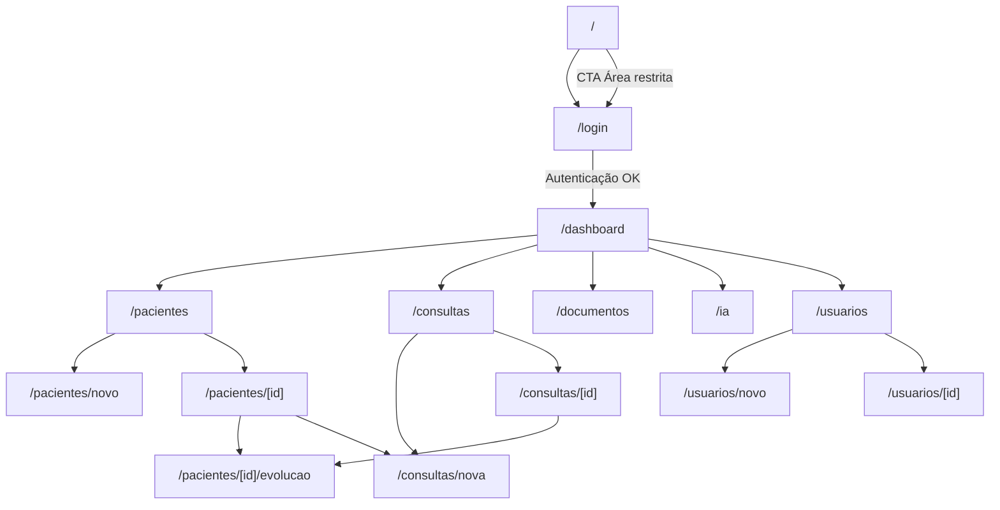
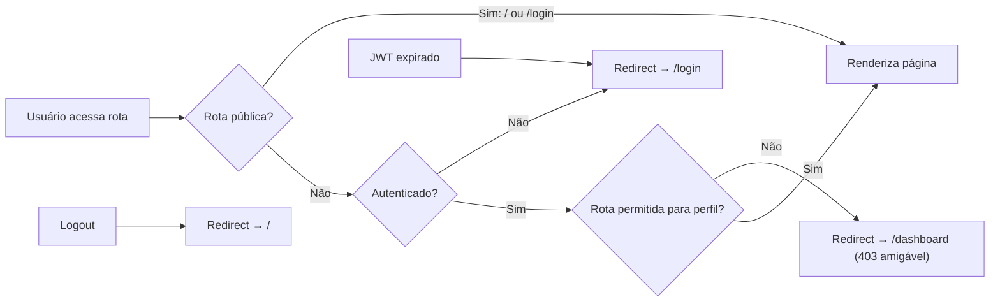
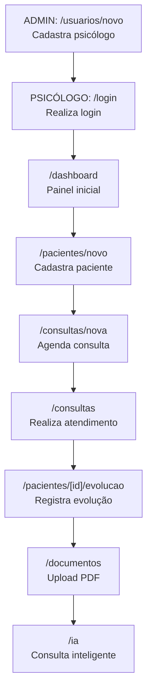
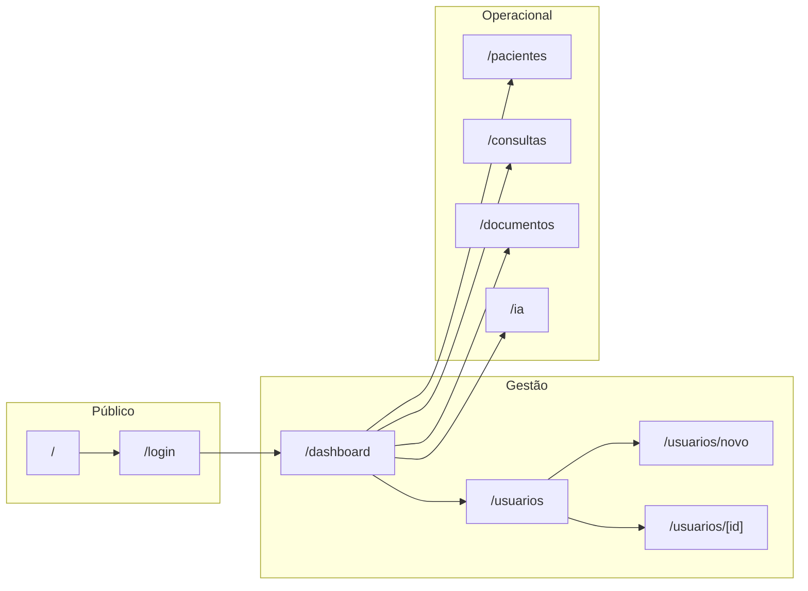
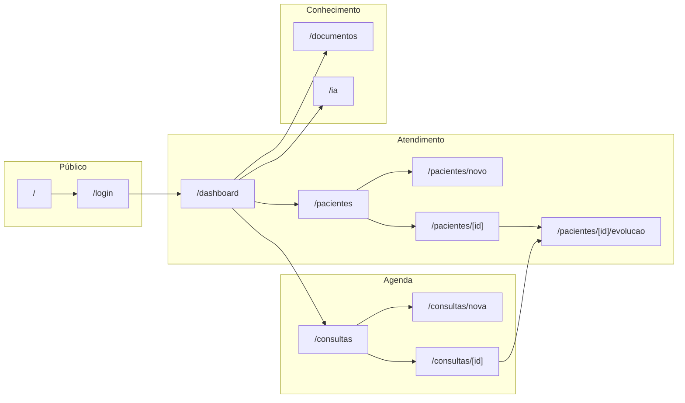
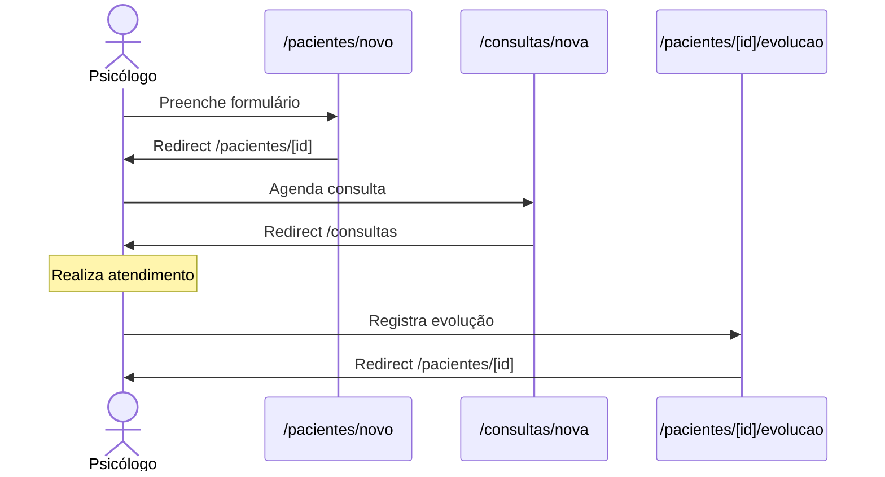
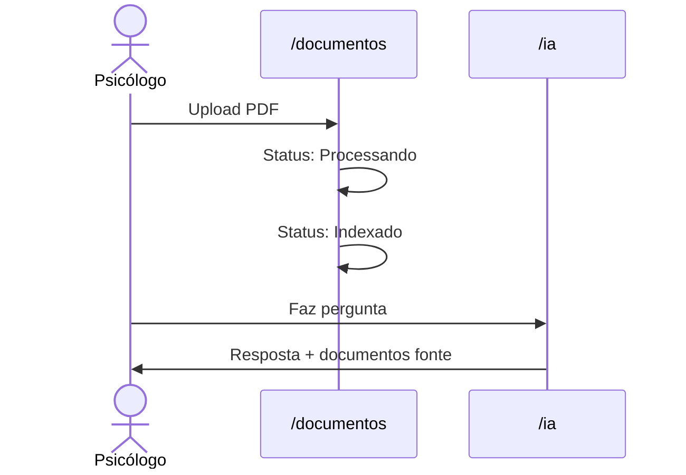
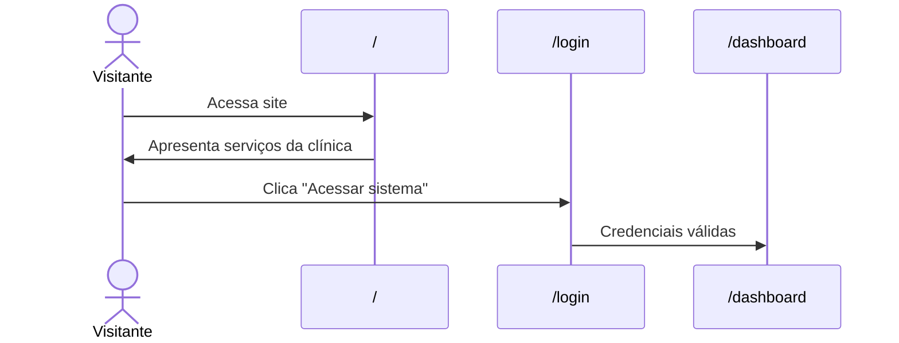
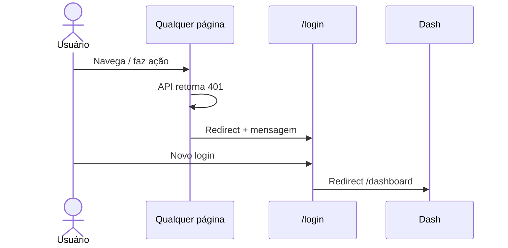

# Fluxo de Páginas — Frontend SelfEvolution

> **Versão:** MVP 1.0  
> **Perfis:** Administrador · Psicólogo  
> **Última atualização:** Julho/2026

Documento de referência para rotas, navegação e jornadas do usuário no frontend.

---

## 1. Mapa de Rotas

```text
/                          → Home pública (landing page)
/login                     → Login (pública)
/dashboard                 → Dashboard (protegida)

/pacientes                 → Listagem de pacientes
/pacientes/novo            → Cadastro de paciente
/pacientes/[id]            → Detalhe / edição de paciente
/pacientes/[id]/evolucao   → Registro de evolução clínica

/consultas                 → Listagem de consultas
/consultas/nova            → Agendar consulta
/consultas/[id]            → Detalhe / edição de consulta

/documentos                → Upload e listagem de documentos

/ia                        → Chat com IA (RAG)

/usuarios                  → Listagem de usuários (ADMIN)
/usuarios/novo             → Cadastro de usuário (ADMIN)
/usuarios/[id]             → Edição de usuário (ADMIN)
```

---

## 2. Árvore de Navegação



---

## 3. Layouts por Grupo de Rotas

| Grupo | Layout | Sidebar | Acesso |
|-------|--------|---------|--------|
| `(public)` | Header + Footer institucional | Não | Público |
| `(auth)` | Centralizado, sem menu | Não | Público |
| `(dashboard)` | Header + Sidebar | Sim | JWT válido |

### Itens da Sidebar

| Item | Rota | Admin | Psicólogo |
|------|------|:-----:|:---------:|
| Dashboard | `/dashboard` | ✅ | ✅ |
| Pacientes | `/pacientes` | ✅ | ✅ |
| Consultas | `/consultas` | ✅ | ✅ |
| Documentos | `/documentos` | ✅ | ✅ |
| IA Clínica | `/ia` | ✅ | ✅ |
| Usuários | `/usuarios` | ✅ | ❌ |

---

## 4. Guards e Redirecionamentos



| Evento | Origem | Destino |
|--------|--------|---------|
| Login bem-sucedido | `/login` | `/dashboard` |
| Token inválido/expirado | Qualquer rota protegida | `/login` |
| Logout | Header | `/` |
| Acesso negado (perfil) | `/usuarios/*` como Psicólogo | `/dashboard` |
| Visitante acessa `/` | URL direta | Home pública (sem redirect) |
| Usuário autenticado acessa `/` | URL direta | Home pública (opcional: link para `/dashboard`) |

---

## 5. Fluxo Principal do MVP

Fluxo end-to-end descrito no MVP, traduzido em páginas:



---

## 6. Jornadas por Perfil

### 6.1 Administrador



**Jornada típica:**

1. (Opcional) Visita `/` — home institucional
2. Login em `/login`
3. Dashboard `/dashboard` — visão geral da clínica
4. `/usuarios/novo` — cadastrar psicólogo
5. `/pacientes` — acompanhar base de pacientes
6. `/consultas` — monitorar agenda

---

### 6.2 Psicólogo



**Jornada típica (dia de atendimento):**

1. Login → Dashboard `/dashboard`
2. `/consultas` — consultas do dia
3. `/consultas/[id]` — abrir consulta
4. `/pacientes/[id]/evolucao` — registrar evolução após sessão
5. `/documentos` — enviar laudo/protocolo em PDF
6. `/ia` — consultar protocolos internos

---

## 7. Detalhamento por Página

### 7.1 `/` — Home Pública

| | |
|---|---|
| **Acesso** | Público (sem autenticação) |
| **Entrada** | URL direta, logout, link externo |
| **Saída** | `/login` (CTA "Área restrita"), âncoras internas |
| **Layout** | Header fixo + seções + footer |

**Seções sugeridas:**

| Seção | Conteúdo |
|-------|----------|
| Hero | Logo, tagline *clínica interdisciplinar*, CTA "Conheça nossos serviços" |
| Sobre | "Na **SELF** Evolution você não está **sozinho(a)!**" — texto acolhedor |
| Serviços | Cards: Psicologia, Avaliação neuropsicológica, Reabilitação cognitiva, Psicopedagogia, Terapia ABA, Fonoaudiologia, Nutrição |
| Diferenciais | Abordagem interdisciplinar, atendimento online e presencial, todas as fases da vida |
| CTA final | Botão "Acessar sistema" → `/login` |
| Footer | Logo, contato, redes sociais |

**Comportamento:**

- Usuário **não autenticado** → exibe home normalmente
- Usuário **autenticado** → exibe home + link "Ir para o painel" no header → `/dashboard`
- Identidade visual alinhada aos posts do Instagram (fundo creme, roxo, decorações sutis)

---

### 7.2 `/login`

| | |
|---|---|
| **Acesso** | Público |
| **Entrada** | URL direta, redirect por falta de auth |
| **Saída** | `/dashboard` (sucesso), `/` (link "Voltar ao site") |
| **Ações** | Entrar, exibir erro de credenciais |

---

### 7.3 `/dashboard` — Dashboard

| | |
|---|---|
| **Acesso** | Admin, Psicólogo |
| **Entrada** | Login, sidebar, logo |
| **Saída** | Qualquer módulo via cards ou sidebar |
| **Conteúdo** | Métricas (pacientes, consultas, documentos), atalhos |
| **Atalhos** | → `/pacientes/novo`, `/consultas/nova`, `/ia` |

---

### 7.4 `/pacientes`

| | |
|---|---|
| **Acesso** | Admin, Psicólogo |
| **Entrada** | Sidebar, dashboard |
| **Saída** | `/pacientes/novo`, `/pacientes/[id]` |
| **Ações** | Buscar, listar, inativar |

---

### 7.5 `/pacientes/novo`

| | |
|---|---|
| **Acesso** | Admin, Psicólogo |
| **Entrada** | Botão "Novo paciente" |
| **Saída** | `/pacientes` (cancelar/salvar), `/pacientes/[id]` (após criar) |
| **Validações** | CPF único (RN06), campos obrigatórios (RN07) |

---

### 7.6 `/pacientes/[id]`

| | |
|---|---|
| **Acesso** | Admin, Psicólogo |
| **Entrada** | Listagem, consulta vinculada |
| **Saída** | `/pacientes`, `/pacientes/[id]/evolucao`, `/consultas/nova` |
| **Conteúdo** | Dados cadastrais, histórico de consultas |
| **Ações** | Editar, inativar (RN08) |

---

### 7.7 `/pacientes/[id]/evolucao`

| | |
|---|---|
| **Acesso** | Psicólogo responsável (RN16) |
| **Entrada** | Detalhe do paciente, detalhe da consulta |
| **Saída** | `/pacientes/[id]`, `/consultas/[id]` |
| **Campos** | Observações, evolução clínica, plano terapêutico |
| **Restrição** | Frontend oculta acesso se usuário não for o responsável |

---

### 7.8 `/consultas`

| | |
|---|---|
| **Acesso** | Admin, Psicólogo |
| **Entrada** | Sidebar, dashboard |
| **Saída** | `/consultas/nova`, `/consultas/[id]` |
| **Ações** | Listar, filtrar por status/data, cancelar |

---

### 7.9 `/consultas/nova`

| | |
|---|---|
| **Acesso** | Admin, Psicólogo |
| **Entrada** | Listagem, detalhe do paciente, dashboard |
| **Saída** | `/consultas` (salvar/cancelar) |
| **Validações** | Conflito de horário (RN10), horário 08:00–20:00 (RN12) |

---

### 7.10 `/consultas/[id]`

| | |
|---|---|
| **Acesso** | Admin, Psicólogo |
| **Entrada** | Listagem de consultas |
| **Saída** | `/consultas`, `/pacientes/[id]/evolucao` |
| **Ações** | Editar, cancelar (RN14), registrar evolução |

---

### 7.11 `/documentos`

| | |
|---|---|
| **Acesso** | Admin, Psicólogo |
| **Entrada** | Sidebar, dashboard |
| **Saída** | Permanece na página (upload inline) |
| **Ações** | Upload PDF, listar, inativar (RN28) |
| **Estados** | Enviando → Processando → Indexado / Erro |

---

### 7.12 `/ia`

| | |
|---|---|
| **Acesso** | Admin, Psicólogo |
| **Entrada** | Sidebar, card no dashboard |
| **Saída** | Permanece na página (chat) |
| **Fluxo** | Pergunta → Resposta → Fontes (RN24) |
| **Erro** | IA offline → callout amigável (RN30) |

---

### 7.13 `/usuarios` — Admin only

| | |
|---|---|
| **Acesso** | Administrador |
| **Entrada** | Sidebar |
| **Saída** | `/usuarios/novo`, `/usuarios/[id]` |
| **Ações** | Listar, inativar (RN01) |

---

### 7.14 `/usuarios/novo` — Admin only

| | |
|---|---|
| **Acesso** | Administrador |
| **Entrada** | Listagem de usuários |
| **Saída** | `/usuarios` |
| **Campos** | Nome, e-mail, senha, perfil |

---

### 7.15 `/usuarios/[id]` — Admin only

| | |
|---|---|
| **Acesso** | Administrador |
| **Entrada** | Listagem de usuários |
| **Saída** | `/usuarios` |
| **Ações** | Editar, inativar |

---

## 8. Fluxos Transversais

### 8.1 Cadastro de paciente → Consulta → Evolução



### 8.2 Upload → Consulta IA



### 8.4 Visitante → Home → Login



### 8.5 Sessão expirada



---

## 9. Matriz Página × Caso de Uso

| Página | UC | RF |
|--------|----|----|
| `/` | — | — |
| `/login` | UC01 | RF01 |
| `/dashboard` | UC08 | RF16 |
| `/pacientes`, `/pacientes/novo`, `/pacientes/[id]` | UC02, UC07 | RF05, RF06 |
| `/consultas`, `/consultas/nova`, `/consultas/[id]` | UC03 | RF07, RF08 |
| `/pacientes/[id]/evolucao` | UC04 | RF09 |
| `/documentos` | UC05 | RF10, RF11 |
| `/ia` | UC06 | RF12, RF13, RF14, RF15 |
| `/usuarios`, `/usuarios/novo`, `/usuarios/[id]` | UC09 | RF03 |

---

## 10. Páginas Futuras (Fora do MVP)

Funcionalidades previstas na documentação do projeto, ainda sem rota no MVP:

| Rota sugerida | Funcionalidade |
|---------------|----------------|
| `/auditoria` | UC10 — logs e auditoria |
| `/agenda/online` | Agendamento online pelo paciente |
| `/financeiro` | Gestão financeira |
| `/convenios` | Convênios |
| `/relatorios` | Relatórios em PDF |
| `/configuracoes` | Horários, duração de consulta, salas |

---

## Referências

- [Processo de Desenvolvimento](./processo-desenvolvimento.md)
- [System Design](./system-design.md)
- [MVP 1.0](../../SelfEvolution-docs/mvp/mvp1.0/mvp1.0.md)
- [Requisitos](../../SelfEvolution-docs/project/requisitos.md)
- [Regras de Negócio](../../SelfEvolution-docs/project/regras_de_negocio.md)
