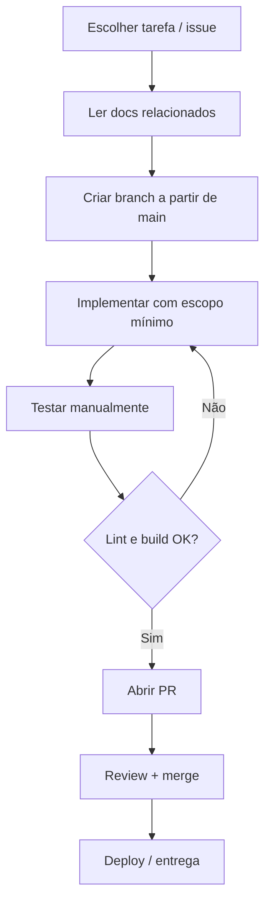
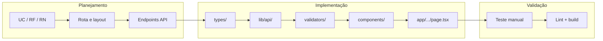
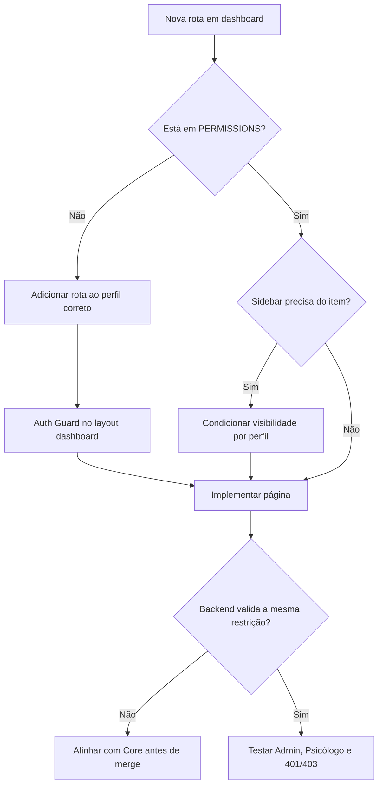

# Processo de Desenvolvimento — Frontend SelfEvolution

> **Versão:** MVP 1.0  
> **Stack:** Next.js 15 · React 19 · Tailwind CSS 3 · TypeScript  
> **Última atualização:** Julho/2026

Guia operacional para configurar o ambiente, implementar funcionalidades, revisar código e entregar o frontend do MVP com consistência.

---

## 1. Documentação do Projeto

Antes de codar, consulte os documentos na ordem abaixo:

| Documento | Conteúdo | Quando usar |
|-----------|----------|-------------|
| [System Design](./system-design.md) | Arquitetura, design system, pastas, API, RBAC | Ao criar componentes, layouts e integrações |
| [Fluxo de Páginas](./fluxo-paginas.md) | Rotas, navegação, jornadas, guards | Ao implementar páginas e redirecionamentos |
| **Este documento** | Setup, workflow, padrões, entrega | No dia a dia de desenvolvimento |
| [MVP 1.0](../../SelfEvolution-docs/mvp/mvp1.0/mvp1.0.md) | Escopo e prioridades | Para validar o que entra ou fica fora |
| [Requisitos](../../SelfEvolution-docs/project/requisitos.md) | RFs e casos de uso | Para mapear telas → requisitos |
| [Regras de Negócio](../../SelfEvolution-docs/project/regras_de_negocio.md) | RNs (validações, permissões) | Antes de implementar formulários e ações |

---

## 2. Pré-requisitos

| Ferramenta | Versão mínima | Observação |
|------------|---------------|------------|
| Node.js | 20.x | Mesma base da imagem Docker |
| npm | 10.x | Vem com Node 20 |
| Git | 2.x | Controle de versão |
| Core API (Spring Boot) | MVP 1.0 | Backend deve estar rodando para fluxos autenticados |

**Recomendado:** editor com suporte a TypeScript, ESLint e Tailwind (VS Code / Cursor).

---

## 3. Configuração do Ambiente

### 3.1 Instalação inicial

```bash
git clone <repo-url> SelfEvolution-frontend
cd SelfEvolution-frontend
npm install
```

### 3.2 Variáveis de ambiente

Crie `.env.local` na raiz do projeto:

```env
NEXT_PUBLIC_API_URL=http://localhost:8080
```

| Variável | Obrigatória | Descrição |
|----------|:-----------:|-----------|
| `NEXT_PUBLIC_API_URL` | Sim | URL base do microsserviço Core |

> **Importante:** nunca commitar `.env.local`. O frontend consome **apenas** o Core API — nunca chama o serviço de IA diretamente (RN29).

### 3.3 Scripts disponíveis

| Comando | Uso |
|---------|-----|
| `npm run dev` | Servidor de desenvolvimento em `http://localhost:3000` |
| `npm run build` | Build de produção |
| `npm run start` | Servidor de produção (após build) |
| `npm run lint` | Verificação ESLint do Next.js |

### 3.4 Docker (opcional)

```bash
docker build -t selfevolution-frontend \
  --build-arg NEXT_PUBLIC_API_URL=http://localhost:8080 .

docker run -p 3000:3000 selfevolution-frontend
```

O Dockerfile usa `output: "standalone"` do Next.js para imagem enxuta em produção.

---

## 4. Fluxo de Trabalho Diário



### Checklist rápido antes de abrir PR

- [ ] Código segue a estrutura de pastas do [System Design](./system-design.md)
- [ ] Rotas e redirecionamentos batem com [Fluxo de Páginas](./fluxo-paginas.md)
- [ ] Regras de negócio aplicáveis foram respeitadas
- [ ] `npm run lint` sem erros
- [ ] `npm run build` conclui com sucesso
- [ ] Fluxo testado manualmente (happy path + erro comum)
- [ ] Nenhum segredo ou `.env` commitado

---

## 5. Git e Branches

### 5.1 Convenção de branches

| Prefixo | Exemplo | Uso |
|---------|---------|-----|
| `feat/` | `feat/login-auth` | Nova funcionalidade |
| `fix/` | `fix/cpf-validation-message` | Correção de bug |
| `refactor/` | `refactor/api-client` | Refatoração sem mudança de comportamento |
| `docs/` | `docs/update-fluxo-paginas` | Apenas documentação |
| `chore/` | `chore/tailwind-tokens` | Configuração, deps, tooling |

### 5.2 Commits

Preferir mensagens curtas no imperativo, em português ou inglês (manter consistência no repositório):

```text
feat: adiciona formulário de cadastro de paciente
fix: corrige redirect em token expirado
docs: atualiza mapa de rotas do MVP
```

Um commit = uma unidade lógica de mudança. Evitar commits gigantes misturando feature + refactor + docs.

### 5.3 Pull Requests

Cada PR deve conter:

1. **Título** claro (`feat: CRUD de pacientes`)
2. **Descrição** com o que foi feito e por quê
3. **Test plan** — passos para validar manualmente
4. **Screenshots** quando houver mudança visual relevante

Fluxo padrão: `feature branch` → PR para `main` → review → merge.

---

## 6. Processo de Implementação de Feature

Siga esta sequência para cada entrega (página, módulo ou componente):



### Passo a passo

| # | Etapa | Detalhe |
|---|-------|---------|
| 1 | **Entender o escopo** | Localizar UC, RF e RN nos docs do projeto |
| 2 | **Definir rota e layout** | `(public)`, `(auth)` ou `(dashboard)` — ver [Fluxo de Páginas](./fluxo-paginas.md) |
| 3 | **Tipos TypeScript** | Criar/atualizar em `types/` |
| 4 | **Camada API** | Funções em `lib/api/` usando o client Axios com JWT |
| 5 | **Validação** | Schema Zod em `lib/validators/` (forms) |
| 6 | **UI** | Componentes em `components/`, página em `app/` |
| 7 | **Permissões** | RBAC visual em `permissions.ts` + guard client-side; **backend valida de fato** |
| 8 | **Estados de UX** | Loading, empty, erro e sucesso conforme [System Design §8](./system-design.md#8-estados-e-feedback) |
| 9 | **Teste manual** | Percorrer jornada do perfil (Admin ou Psicólogo) |
| 10 | **PR** | Abrir com test plan |

### Ordem de implementação (sprints)

> **Prioridade:** estética e UX completas **antes** da integração com o Core API. Telas usam dados mock até a sprint final.

| Sprint | Foco | Entregáveis |
|--------|------|-------------|
| **1** ✅ | Fundação | Tokens Tailwind, layout shell, home, login e dashboard placeholders |
| **2** | Estética + UI | Refino visual, logo/favicon, componentes polidos, todas as telas MVP com mock |
| **3** | Telas operacionais | Forms e listagens (pacientes, consultas, evolução, documentos, IA, usuários) — só UI |
| **4** | Estados de UX | Loading, empty states, erros, responsividade fina, acessibilidade |
| **5** | Integração | Auth JWT, Axios, Core API, substituir mocks por dados reais |

Dentro das sprints 2–4, priorizar **slice visual** (rota + layout + componentes + mock) — **sem** chamadas à API.

### Integração fica por último

| O que adiar | Por quê |
|-------------|---------|
| Auth Context / JWT | Não bloqueia refinamento visual |
| Axios + interceptors | Telas funcionam com dados estáticos |
| CRUD real | Forms e tabelas validam UX antes do contrato API |

Quando chegar a Sprint 5, plugar a API nas telas já prontas — diff menor e visual estável.

---

## 7. Padrões de Código

### 7.1 Estrutura e nomenclatura

| Item | Convenção |
|------|-----------|
| Páginas | `app/(grupo)/modulo/page.tsx` — App Router do Next.js |
| Componentes UI | `components/ui/Button.tsx` — PascalCase |
| Hooks | `hooks/usePacientes.ts` — prefixo `use` |
| API | `lib/api/pacientes.ts` — funções por domínio |
| Tipos | `types/paciente.ts` — singular, export nomeado |
| Utilitários | `lib/utils/formatCPF.ts` — camelCase |

### 7.2 Componentes

- **Server Components** por padrão; `"use client"` só quando houver estado, efeitos ou event handlers
- Componentes pequenos e focados — preferir composição a props excessivas
- Reutilizar tokens do design system (cores, tipografia, radius) — não hardcodar hex fora do Tailwind config
- Ícones via **Lucide React** (quando adicionado ao projeto)

### 7.3 Formulários

Stack recomendada: **React Hook Form + Zod + `@hookform/resolvers`**

- Validação client-side espelha **formato** (e-mail, CPF, tamanho de arquivo) — regras de negócio ficam no Core
- Erros da API exibidos inline no campo correspondente
- Botão de submit desabilitado durante envio (`isSubmitting`)

### 7.4 Integração com API

- Toda chamada HTTP passa por `lib/api/client.ts` (interceptors JWT + 401)
- Um arquivo por domínio (`pacientes.ts`, `consultas.ts`, etc.)
- Não usar `fetch`/`axios` solto dentro de componentes de página
- Tratar 401 globalmente (redirect para `/login`)

### 7.5 Estilo (Tailwind)

- Usar classes utilitárias; agrupar repetições com `@apply` apenas em casos justificados
- Responsividade: mobile funcional, **desktop first** (uso principal em clínica)
- Manter contraste WCAG AA e focus visible em interativos

---

## 8. Autenticação, Permissões e Segurança

> **Princípio:** o Core API (Spring Boot) é a fronteira de segurança. O frontend **não reimplementa** regras de negócio nem confia apenas em guards locais. Detalhes completos em [System Design §6.1](./system-design.md#61-segurança--divisão-de-responsabilidades).

### 8.1 Divisão de responsabilidades

| Camada | Papel |
|--------|-------|
| **Core API** | JWT, RBAC, RNs, LGPD, gateway da IA (RN29) |
| **Frontend** | Armazenar/enviar token, UX de permissões, validação leve de formulário, higiene no browser |

**Regra de ouro:** se o frontend bloqueia algo na UI, o backend **também** deve bloquear na API.

### 8.2 Decisão MVP — JWT

| Item | Valor |
|------|-------|
| Armazenamento | `localStorage`, chave `se_token` |
| Envio | `Authorization: Bearer <token>` via Axios interceptor |
| Perfil | Retornado no login → Auth Context (memória) |
| Guard de rotas | Client-side no layout `(dashboard)` — middleware Next.js **não** lê `localStorage` |
| Logout | `removeToken()` + limpar context + redirect `/` |
| 401 da API | Interceptor global → limpar token → `/login` (RN05) |

Implementar helpers em `lib/auth/token.ts`; não espalhar `localStorage` nos componentes.

### 8.3 Checklist ao criar rota ou ação protegida



| Perfil | Rotas exclusivas | Observação |
|--------|------------------|------------|
| **ADMIN** | `/usuarios/*` | CRUD de usuários |
| **PSICÓLOGO** | — | Sem acesso a usuários; evolução só se responsável (RN16) |

Ao criar rota protegida:

1. Registrar em `lib/auth/permissions.ts` (mapa de UX)
2. Adicionar guard no layout `(dashboard)` (redirect se sem token)
3. Ocultar item na sidebar se perfil não tiver acesso
4. **Confirmar** que o Core retorna 403 para a mesma ação
5. Tratar 403 amigável → redirect `/dashboard`

### 8.4 O que **não** fazer no frontend

- Tratar `permissions.ts` como ACL definitiva
- Chamar o microsserviço de IA diretamente (RN29)
- Colocar segredos em variáveis `NEXT_PUBLIC_*`
- Duplicar lógica de RN complexa “por garantia” — delegar ao Core e exibir o erro retornado
- Expor CPF, prontuário ou dados clínicos em URL ou `console.log`

---

## 9. Testes

No MVP, a estratégia é **teste manual estruturado** + lint/build automatizável.

### 9.1 Matriz mínima por módulo

| Módulo | Cenários obrigatórios |
|--------|----------------------|
| Login | Credenciais válidas, inválidas, redirect pós-login, link "Voltar ao site" |
| Pacientes | Criar, editar, buscar, CPF duplicado (RN06), inativar com consultas (RN08) |
| Consultas | Agendar, conflito de horário (RN10), horário fora da faixa (RN12), cancelar (RN14) |
| Evolução | Acesso permitido/negado por responsável (RN16) |
| Documentos | Upload PDF, limite 50 MB (RN20), estados processando/indexado/erro |
| IA | Pergunta com resposta + fontes (RN24), IA offline (RN30) |
| Usuários | Apenas ADMIN acessa; Psicólogo redirecionado |

### 9.2 Teste de regressão rápido

Após qualquer PR que toque auth ou layout:

1. Visitante acessa `/` → home pública OK
2. Login → `/dashboard`
3. Navegar sidebar completa (perfil Admin)
4. Logout → redirect `/`
5. Acessar rota protegida sem token → `/login`

### 9.3 Evolução futura

Quando o MVP estabilizar, considerar:

- **Vitest + Testing Library** — componentes e hooks
- **Playwright** — fluxos E2E críticos (login, cadastro paciente, upload)
- **CI** — `lint`, `build` e testes em pipeline

---

## 10. Build, Deploy e Ambientes

| Ambiente | API URL típica | Comando |
|----------|----------------|---------|
| Local | `http://localhost:8080` | `npm run dev` |
| Staging | URL do Core em staging | `npm run build && npm run start` |
| Produção | URL do Core em produção | Docker image |

### Checklist de release

- [ ] `NEXT_PUBLIC_API_URL` aponta para o Core correto no build
- [ ] `npm run build` sem warnings críticos
- [ ] Smoke test: home, login, dashboard
- [ ] Variáveis sensíveis apenas no ambiente — nunca no repositório

---

## 11. Definition of Done (DoD)

Uma tarefa está **pronta** quando:

| Critério | ✓ |
|----------|:-:|
| Implementação alinhada ao escopo do MVP | |
| Regras de negócio **delegadas ao backend** — frontend só exibe erros/estados | |
| UI segue design system (cores, tipografia, componentes) | |
| Estados loading / empty / erro tratados | |
| RBAC visual respeitado; Core retorna 403 para ações negadas | |
| Token: `localStorage` + Bearer; logout e 401 limpam sessão | |
| Sem segredos em `NEXT_PUBLIC_*`; sem dados clínicos em URL | |
| Sem `console.log` ou código morto | |
| `npm run lint` e `npm run build` OK | |
| Test plan executado e descrito no PR | |
| Documentação atualizada se rotas ou fluxos mudaram | |

---

## 12. Manutenção da Documentação

Atualize os docs quando:

| Mudança | Documento(s) a atualizar |
|---------|------------------------|
| Nova rota ou redirect | [fluxo-paginas.md](./fluxo-paginas.md) |
| Novo componente base, token ou endpoint | [system-design.md](./system-design.md) |
| Novo fluxo de trabalho, script ou padrão | Este documento |
| Mudança de escopo MVP | Docs em `SelfEvolution-docs/` |

Manter a data de **Última atualização** no cabeçalho ao editar.

---

## 13. Troubleshooting Comum

| Problema | Causa provável | Solução |
|----------|----------------|---------|
| 401 em todas as requisições | Token ausente/expirado | Verificar auth context e interceptor; refazer login |
| CORS / network error | Core API offline ou URL errada | Conferir `NEXT_PUBLIC_API_URL` e se o backend está up |
| Estilos não aplicam | Tailwind config ou import CSS | Verificar `globals.css` no root layout e paths no `tailwind.config.js` |
| Build falha no Docker | Env não passada no build | Usar `--build-arg NEXT_PUBLIC_API_URL=...` |
| Redirect loop login/dashboard | Guard client-side ou token inválido | Inspecionar `localStorage`, Auth Context e interceptor 401 |

---

## Referências

- [System Design](./system-design.md)
- [Fluxo de Páginas](./fluxo-paginas.md)
- [MVP 1.0](../../SelfEvolution-docs/mvp/mvp1.0/mvp1.0.md)
- [Requisitos](../../SelfEvolution-docs/project/requisitos.md)
- [Regras de Negócio](../../SelfEvolution-docs/project/regras_de_negocio.md)
- [Next.js Docs](https://nextjs.org/docs)
- [Tailwind CSS Docs](https://tailwindcss.com/docs)
