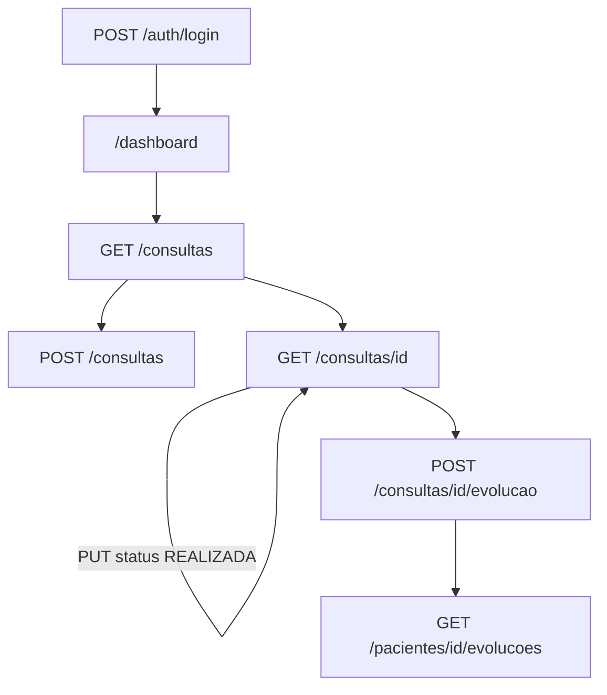
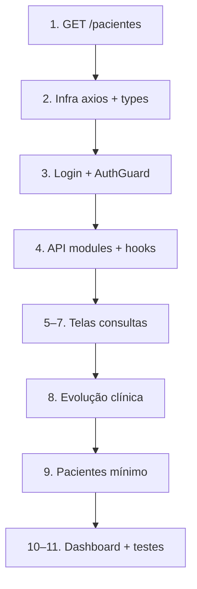

# Sprint 3 — Plano de Integração Frontend (Consultas + Evolução Clínica)

> **Projeto:** SelfEvolution MVP 1.0  
> **Stack frontend:** Next.js 15 · React 19 · Tailwind · TypeScript · Axios  
> **Backend:** SelfEvolution-backend-core (`http://localhost:8080`)  
> **Referência de API:** [Guia de API para o Frontend](./api-guia-frontend.md)  
> **Última atualização:** Agosto/2026

---

## 1. Contexto

### Sprints concluídas

| Sprint | Escopo | Status |
|--------|--------|--------|
| **Sprint 1** | Infraestrutura (Docker, PostgreSQL, Spring Boot, FastAPI, Next.js) | ✅ Concluída |
| **Sprint 2** | Autenticação JWT, CRUD Usuários, Psicólogos, Pacientes | ✅ Concluída |
| **Sprint 3 (backend)** | CRUD Consultas, Evolução Clínica | ✅ Concluída |
| **Sprint 3 (frontend)** | Integração com o Core API | 🔲 Pendente |

### O que falta

O backend já expõe todas as rotas de consultas e evolução clínica. No frontend:

- Rotas `/consultas`, `/consultas/nova` existem como **placeholder** (`ComingSoon`)
- Rotas `/consultas/[id]` e `/pacientes/[id]/evolucao` **não existem**
- Não há camada API (Axios), auth real nem guards
- Login é demonstrativo (timeout mock)

**Entrega desta sprint:** fluxo completo de atendimento conectado ao Core API.

---

## 2. Objetivo e escopo

### Objetivo

Conectar o frontend ao backend para permitir o fluxo end-to-end:

```
Login → Agendar consulta → Listar consultas → Marcar como realizada → Registrar evolução clínica
```

### Dentro do escopo

- Infra de integração (Axios, JWT, guards, tipos)
- Login real (`POST /auth/login`)
- Telas de consultas (`/consultas`, `/nova`, `/[id]`)
- Evolução clínica (`/pacientes/[id]/evolucao`)
- Dependências mínimas: selects de paciente, psicólogo e serviço
- Tratamento de erros da API (400, 401, 403, 404, 409)

### Fora do escopo

- Documentos, IA, usuários (outras sprints)
- Paginação avançada
- Middleware Next.js server-side
- Configuração CORS no backend (usar proxy no Next se necessário)

---

## 3. Referência rápida da API

> Detalhes completos em [`docs/api-guia-frontend.md`](./api-guia-frontend.md).

### Autenticação

```http
POST /auth/login
Content-Type: application/json

{ "email": "...", "senha": "..." }
```

**Resposta 200:**
```json
{ "token": "...", "type": "Bearer", "role": "PACIENTE" | "ADMIN" | "PSICOLOGO" }
```

**Erro 400:** texto plano `"Email ou senha invalidos"` (não JSON).

**Uso:** `Authorization: Bearer {token}` em todas as rotas autenticadas. Token expira em ~2h.

### Papéis e permissões (resumo)

| Recurso | PACIENTE | PSICOLOGO | ADMIN |
|---------|:--------:|:---------:|:-----:|
| Consultas | Próprias | Próprias | Todas |
| Cancelar consulta | `DELETE` → soft (`200`) | `DELETE` → hard (`204`) | `DELETE` → hard (`204`) |
| Evolução clínica | ❌ | ✅ (consultas dele) | ✅ |
| Criar psicólogo | ❌ | ❌ | ✅ |
| Listar psicólogos | ✅ leitura | ✅ leitura | ✅ total |

### Status de consulta (enum real)

```json
"AGENDADA" | "REALIZADA" | "CANCELADA"
```

> Docs antigos mencionam "Confirmada" — **usar apenas o enum do backend**.

### Rotas principais desta sprint

| Método | Rota | Uso no frontend |
|--------|------|-----------------|
| POST | `/auth/login` | Login |
| GET | `/psicologos` | Select psicólogo no agendamento |
| GET | `/psicologos/{id}/servicos` | Select serviço |
| GET | `/psicologos/{id}/horarios` | Montar disponibilidade |
| POST | `/consultas` | Agendar |
| GET | `/consultas` | Listagem |
| GET | `/consultas/{id}` | Detalhe |
| PUT | `/consultas/{id}` | Editar / marcar `REALIZADA` |
| DELETE | `/consultas/{id}` | Cancelar ou excluir |
| POST | `/consultas/{id}/evolucao` | Criar evolução |
| GET | `/consultas/{id}/evolucao` | Buscar evolução |
| PUT | `/consultas/{id}/evolucao` | Editar evolução |
| GET | `/pacientes/{id}/evolucoes` | Histórico clínico |

### Formato de erro padrão

```json
{
  "status": 400,
  "erro": "Bad Request",
  "mensagem": "Insira um CPF valido",
  "path": "/pacientes",
  "timestamp": "2026-08-15T17:00:00.123Z"
}
```

---

## 4. Bloqueadores conhecidos

### 4.1 Sem `GET /pacientes` (listagem)

O guia de API expõe apenas:

- `POST /pacientes` (público)
- `GET /pacientes/{id}` (por UUID)

**Impacto:** o formulário de agendamento (select de paciente) e a listagem `/pacientes` não funcionam sem listagem.

**Ação recomendada (backend, pequena):**

```
GET /pacientes → PacienteResponse[]  (ADMIN e PSICOLOGO)
```

**Alternativa temporária:** busca por UUID manual (não recomendada para UX).

### 4.2 CORS

Backend não configura CORS explicitamente. Em dev:

- Configurar **proxy** no `next.config.js`, ou
- Adicionar CORS no Spring Boot

### 4.3 Paciente sem controle de ownership

Qualquer autenticado pode `GET/PUT/DELETE /pacientes/{id}` de qualquer UUID. Tratar no frontend se necessário; backend valida consultas por role.

---

## 5. Fluxo alvo no frontend



### Por perfil

**Paciente**
```
POST /pacientes → POST /auth/login → GET /psicologos → GET servicos/horarios
→ POST /consultas → GET /consultas → DELETE ou PUT cancelar
```

**Psicólogo**
```
POST /auth/login → GET /consultas → PUT REALIZADA
→ POST /consultas/id/evolucao → GET /pacientes/id/evolucoes
```

**Admin**
```
POST /auth/login → GET /consultas (todas) → gestão completa
→ GET /pacientes/id/evolucoes
```

---

## 6. Fases de implementação

### Fase 0 — Infra transversal (pré-requisito)

| Item | Arquivo | Descrição |
|------|---------|-----------|
| Env | `.env.local` | `NEXT_PUBLIC_API_URL=http://localhost:8080` |
| Token | `lib/auth/token.ts` | `getToken`, `setToken`, `removeToken` → `localStorage` (`se_token`) |
| Context | `lib/auth/context.tsx` | `{ token, role, login, logout }` |
| Permissões | `lib/auth/permissions.ts` | Mapa ADMIN / PSICOLOGO / PACIENTE → rotas |
| Guard | `lib/auth/AuthGuard.tsx` | Redirect `/login` se sem token |
| Cliente HTTP | `lib/api/client.ts` | Axios + interceptor Bearer + 401 → `/login?expired=1` |
| Erros | `lib/api/errors.ts` | `parseApiError()` — JSON ou texto plano (login) |

**Proxy CORS (opcional em `next.config.js`):**

```js
async rewrites() {
  return [
    {
      source: "/api/:path*",
      destination: "http://localhost:8080/:path*",
    },
  ];
}
```

Se usar proxy, `NEXT_PUBLIC_API_URL=/api`.

**Login real** — substituir stub em `components/auth/LoginForm.tsx`:

1. `POST /auth/login`
2. Salvar `token` + `role`
3. Redirect → `/dashboard`

**Layout dashboard** — envolver `(dashboard)/layout.tsx` com `AuthProvider` + `AuthGuard`.

---

### Fase 1 — Tipos e módulos API

#### Types (`types/`)

```
auth.ts       → AuthResponse, Role
consulta.ts   → ConsultaResponse, CreateConsultaRequest, UpdateConsultaRequest, StatusConsulta
evolucao.ts   → EvolucaoClinicaResponse, Create/UpdateEvolucaoClinicaRequest
paciente.ts   → PacienteResponse, CreatePacienteRequest
psicologo.ts  → PsychologistResponse, ServiceResponse, HorarioAtendimentoResponse
api.ts        → ApiErrorResponse
```

#### Módulos API (`lib/api/`)

| Arquivo | Endpoints |
|---------|-----------|
| `auth.ts` | `login(email, senha)` |
| `pacientes.ts` | CRUD `/pacientes` |
| `psicologos.ts` | `listar`, `buscar`, `listarServicos`, `listarHorarios` |
| `consultas.ts` | CRUD `/consultas` |
| `evolucoes.ts` | CRUD `/consultas/{id}/evolucao`, `listarPorPaciente` |

#### Hooks (`hooks/`)

| Hook | Responsabilidade |
|------|------------------|
| `useAuth()` | Token, role, login, logout |
| `useConsultas(filtros?)` | Listagem + loading/error/refresh |
| `useConsulta(id)` | Detalhe |
| `useEvolucao(consultaId)` | GET/POST/PUT evolução |
| `usePacientes()` | Listagem (após `GET /pacientes`) |
| `usePsicologos()` | Select no form |

---

### Fase 2 — Consultas (UC03)

#### `/consultas` — Listagem

Substituir `ComingSoon` por:

- Tabela: Paciente, Psicólogo, Data/Hora, Status, Ações
- `GET /consultas` (filtro automático por role)
- Badges: `AGENDADA`, `REALIZADA`, `CANCELADA`
- Filtros client-side: status, intervalo de datas
- Empty state + loading skeleton
- Ações: Ver → `/consultas/[id]`, Nova → `/consultas/nova`

**Comportamento por role na listagem:**

| Role | API |
|------|-----|
| PACIENTE | `GET /consultas` — só as dele |
| PSICOLOGO | `GET /consultas` — só as dele |
| ADMIN | `GET /consultas` ou `?pacienteId=&psicologoId=` |

#### `/consultas/nova` — Agendar

Componente: `components/forms/AppointmentForm.tsx`

| Campo | Fonte |
|-------|-------|
| Paciente | `GET /pacientes` (ou input UUID até endpoint existir) |
| Psicólogo | `GET /psicologos` |
| Serviço | `GET /psicologos/{id}/servicos` (ao selecionar psicólogo) |
| Data/hora | Input datetime-local |
| Observações | Textarea opcional |

**Submit:** `POST /consultas`

```json
{
  "pacienteId": "uuid",
  "psicologoId": "uuid",
  "servicoId": "uuid | null",
  "dataHoraInicio": "2026-08-20T09:00:00",
  "dataHoraFim": "2026-08-20T09:50:00",
  "observacoes": "..."
}
```

**Validações UX (backend também valida):**

| Regra | Mensagem sugerida |
|-------|-------------------|
| Conflito de horário | "Horário indisponível para este psicólogo" |
| Fora do horário cadastrado | "Fora do horário de atendimento" |
| Data no passado | "Não é possível agendar no passado" |
| Psicólogo sem horários | "Psicólogo sem horários cadastrados" |
| PACIENTE usa outro pacienteId | 403 — "Sem permissão" |

**Dica UX:** cruzar `GET horarios` + `GET /consultas?psicologoId=` para sugerir slots livres.

**Sucesso:** redirect → `/consultas`.

#### `/consultas/[id]` — Detalhe (rota a criar)

- `GET /consultas/{id}`
- Exibir dados + status
- **Editar** (`PUT /consultas/{id}`):
  - PACIENTE: só `{ "status": "CANCELADA" }`
  - PSICOLOGO/ADMIN: datas, serviço, status, observações
- **Marcar realizada:** `PUT { "status": "REALIZADA" }`
- **Registrar evolução:** link → `/pacientes/{pacienteId}/evolucao?consultaId={id}` (só se `REALIZADA` + role PSICOLOGO/ADMIN)
- **Cancelar/excluir** (`DELETE /consultas/{id}`):
  - PACIENTE → esperar `200` + body (`CANCELADA`)
  - PSICOLOGO/ADMIN → esperar `204`

---

### Fase 3 — Evolução clínica (UC04)

#### `/pacientes/[id]/evolucao` — Rota a criar

**Query param obrigatório:** `?consultaId=uuid`

**Campos (mapeamento API):**

| Label UI | Campo API | Obrigatório |
|----------|-----------|:-----------:|
| Evolução clínica | `descricao` | ✅ |
| Humor | `humor` | ❌ |
| Observações | `observacoes` | ❌ |

**Fluxo:**

1. `GET /consultas/{consultaId}` — validar `status === "REALIZADA"`
2. Tentar `GET /consultas/{consultaId}/evolucao`
   - 404 → formulário de criação (`POST`)
   - 200 → formulário de edição (`PUT`)
3. Após salvar → redirect `/consultas/[id]` ou `/pacientes/[id]`

**Regras:**

- Só ADMIN e PSICOLOGO (403 para PACIENTE — não exibir botão)
- PSICOLOGO só evolui consultas dele
- 1 evolução por consulta — segunda criação retorna erro; UI deve oferecer edição

#### Histórico — `/pacientes/[id]` (stretch)

- `GET /pacientes/{id}/evolucoes` — timeline
- `GET /consultas?pacienteId={id}` — consultas do paciente (ADMIN)

---

### Fase 4 — Pacientes mínimo (dependência)

| Rota | Integração |
|------|------------|
| `/pacientes` | `GET /pacientes` *(pendente no backend)* |
| `/pacientes/novo` | `POST /pacientes` |
| `/pacientes/[id]` | `GET /pacientes/{id}` + consultas + link evolução |

---

### Fase 5 — Dashboard (opcional)

Substituir métricas hardcoded:

- Consultas do mês → `GET /consultas` + filtro por data
- Atalhos → `/consultas/nova`, `/pacientes/novo`

---

## 7. Mapeamento rotas frontend ↔ API

| Página frontend | Métodos API | Perfis |
|-----------------|-------------|--------|
| `/login` | `POST /auth/login` | Público |
| `/consultas` | `GET /consultas` | Todos autenticados |
| `/consultas/nova` | `GET /psicologos`, `GET .../servicos`, `GET .../horarios`, `POST /consultas` | Todos |
| `/consultas/[id]` | `GET`, `PUT`, `DELETE /consultas/{id}` | Conforme role |
| `/pacientes/[id]/evolucao` | `GET/POST/PUT /consultas/{id}/evolucao` | ADMIN, PSICOLOGO |
| `/pacientes/[id]` | `GET /pacientes/{id}`, `GET /pacientes/{id}/evolucoes` | ADMIN, PSICOLOGO |

---

## 8. Regras de negócio na UI

| RN | Regra | Implementação frontend |
|----|-------|------------------------|
| RN10 | Conflito de horário | Exibir `mensagem` do 400 |
| RN12 | Horário clínica 08:00–20:00 | Validar antes do submit; cruzar com horários do psicólogo |
| RN14 | Cancelamento | PACIENTE: PUT ou DELETE; bloquear se já REALIZADA/CANCELADA |
| RN16 | Evolução só do responsável | Ocultar botão; tratar 403 |
| — | Evolução exige REALIZADA | Botão desabilitado + tooltip |
| — | 1 evolução/consulta | GET antes; se existe, modo edição |
| — | DELETE consulta dual | Tratar 200 (cancel) vs 204 (delete) |

---

## 9. Estrutura de arquivos a criar

```
lib/
  api/
    client.ts
    errors.ts
    auth.ts
    consultas.ts
    evolucoes.ts
    pacientes.ts
    psicologos.ts
  auth/
    token.ts
    context.tsx
    permissions.ts
    AuthGuard.tsx

types/
  auth.ts
  consulta.ts
  evolucao.ts
  paciente.ts
  psicologo.ts
  api.ts

hooks/
  useAuth.ts
  useConsultas.ts
  useConsulta.ts
  useEvolucao.ts
  usePacientes.ts
  usePsicologos.ts

components/forms/
  AppointmentForm.tsx
  EvolucaoForm.tsx

app/(dashboard)/
  consultas/[id]/page.tsx          ← criar
  pacientes/[id]/page.tsx          ← criar
  pacientes/[id]/evolucao/page.tsx ← criar
```

---

## 10. Ordem de execução

| # | Tarefa | Depende de | Estimativa |
|---|--------|------------|------------|
| 1 | Backend: `GET /pacientes` | — | 0,5 dia |
| 2 | Infra: axios, types, errors | — | 1 dia |
| 3 | Auth: login + guard + logout | 2 | 0,5 dia |
| 4 | API modules + hooks | 2, 3 | 1 dia |
| 5 | `/consultas` listagem | 4 | 1 dia |
| 6 | `/consultas/nova` form | 4, 1 | 1,5 dia |
| 7 | `/consultas/[id]` detalhe | 4 | 1,5 dia |
| 8 | `/pacientes/[id]/evolucao` | 4, 7 | 1 dia |
| 9 | Pacientes listagem + novo | 1, 4 | 1 dia |
| 10 | Dashboard métricas reais | 4 | 0,5 dia |
| 11 | Teste E2E manual | tudo | 0,5 dia |

**Total estimado:** ~8–9 dias



---

## 11. Critérios de pronto (Definition of Done)

- [ ] Login real com JWT; dashboard protegido por guard
- [ ] Psicólogo/Admin agenda consulta end-to-end
- [ ] Listagem de consultas com dados reais
- [ ] Edição e cancelamento respeitam perfil (200 vs 204 no DELETE)
- [ ] Consulta `REALIZADA` → evolução registrada com sucesso
- [ ] Erros de negócio exibidos na UI (não só no console)
- [ ] 401 redireciona para `/login?expired=1`
- [ ] Paciente não vê telas de evolução clínica
- [ ] `npm run lint` e `npm run build` passam
- [ ] Teste manual documentado no PR:

```
Admin cadastra psicólogo → Psicólogo login → Cadastra paciente →
Agenda consulta → Marca REALIZADA → Registra evolução
```

---

## 12. Riscos e mitigações

| Risco | Mitigação |
|-------|-----------|
| Sem `GET /pacientes` | Implementar no backend antes do form de agendamento |
| CORS bloqueia requests | Proxy no Next ou CORS no Spring |
| Status "Confirmada" nos docs antigos | Usar `AGENDADA` do backend |
| DELETE consulta dual (200 vs 204) | Tratar ambos no client |
| Login retorna texto plano no erro | `parseApiError` detecta content-type |
| Índices de horários mudam após DELETE | Re-fetch lista após mutação |
| Token expira em 2h | Interceptor 401 + redirect |

---

## 13. Referências

| Documento | Conteúdo |
|-----------|----------|
| [api-guia-frontend.md](./api-guia-frontend.md) | Rotas, auth, payloads, fluxos |
| [system-design.md](./system-design.md) | Arquitetura frontend, RBAC, API layer |
| [fluxo-paginas.md](./fluxo-paginas.md) | Rotas, jornadas, guards |
| [processo-desenvolvimento.md](./processo-desenvolvimento.md) | Workflow, padrões de código |

---

*Plano alinhado ao guia de API SelfEvolution-backend-core — Sprint 3, integração frontend.*
