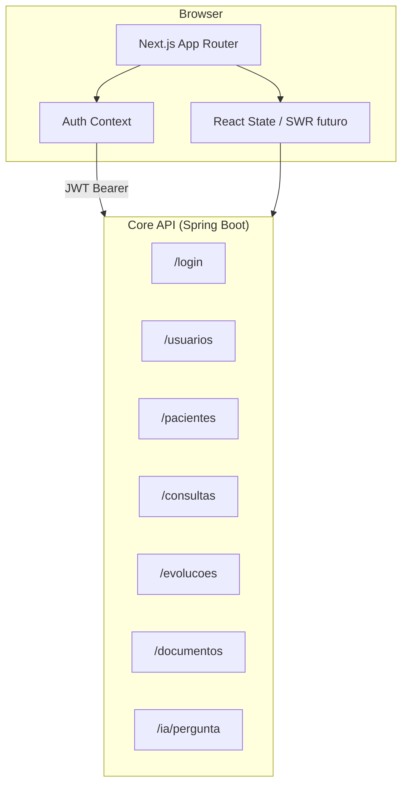
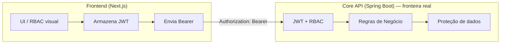

# System Design — Frontend SelfEvolution

> **Versão:** MVP 1.0  
> **Stack:** Next.js 15 · React 19 · Tailwind CSS 3 · Axios  
> **Última atualização:** Julho/2026

---

## 1. Visão Geral

O frontend é uma aplicação **Next.js 15 (App Router)** + **React 19** + **Tailwind CSS 3**, que consome exclusivamente o **microsserviço Core (Spring Boot)** via REST/JSON. Nunca acessa o serviço de IA diretamente (RN29).

**Perfis no MVP:** Administrador e Psicólogo (Recepcionista fica fora).

### Princípios de UX

- **Profissional e acolhedor** — identidade clínica, não corporativa fria
- **Clareza e legibilidade** — público inclui idosos e profissionais de saúde
- **Hierarquia por peso tipográfico** — palavras-chave em negrito (como nos posts do Instagram)
- **Espaço generoso** — fundo creme, cards brancos, pouco ruído visual

---

## 2. Design System

> Identidade visual extraída dos posts do Instagram da clínica SelfEvolution.

### 2.1 Paleta de Cores

| Token | Hex | Uso |
|-------|-----|-----|
| `brand-primary` | `#6B4E91` | Botões primários, títulos, links ativos, sidebar ativa |
| `brand-primary-dark` | `#563D78` | Hover de botões, estados pressed |
| `brand-primary-light` | `#8B6BB5` | Bordas ativas, ícones secundários |
| `brand-secondary` | `#6297F5` | Callouts informativos, badges, links secundários |
| `brand-accent-yellow` | `#F4CC47` | Destaques pontuais, notificações suaves |
| `brand-accent-blue` | `#82C4FF` | Decorações, ícones decorativos |
| `brand-accent-teal` | `#5BBFB5` | Status positivo alternativo |
| `brand-accent-coral` | `#E8716D` | Alertas suaves (logo) |
| `surface-background` | `#FDFBF2` | Fundo geral da aplicação |
| `surface-card` | `#FFFFFF` | Cards, modais, inputs |
| `surface-muted` | `#F5F2EA` | Hover de linhas de tabela, áreas secundárias |
| `text-primary` | `#333333` | Texto principal |
| `text-secondary` | `#4A4A4A` | Texto de apoio, labels |
| `text-muted` | `#7A7A7A` | Placeholders, hints |
| `text-inverse` | `#FFFFFF` | Texto sobre fundos coloridos |
| `border-default` | `#E8E4DA` | Bordas de cards e inputs |
| `border-focus` | `#6B4E91` | Focus ring |
| `status-success` | `#4CAF50` | Consulta confirmada, upload OK |
| `status-warning` | `#F4CC47` | Pendente, processando |
| `status-error` | `#D32F2F` | Erros, cancelamentos |
| `status-info` | `#6297F5` | Informações, IA processando |

#### Configuração Tailwind

```js
// tailwind.config.js → theme.extend.colors
colors: {
  brand: {
    primary: { DEFAULT: '#6B4E91', dark: '#563D78', light: '#8B6BB5' },
    secondary: '#6297F5',
    accent: { yellow: '#F4CC47', blue: '#82C4FF', teal: '#5BBFB5', coral: '#E8716D' },
  },
  surface: {
    background: '#FDFBF2',
    card: '#FFFFFF',
    muted: '#F5F2EA',
  },
  content: {
    primary: '#333333',
    secondary: '#4A4A4A',
    muted: '#7A7A7A',
    inverse: '#FFFFFF',
  },
}
```

### 2.2 Tipografia

**Família principal:** `Nunito` (títulos) + `Inter` (corpo/UI)  
**Alternativa única:** `Montserrat` em todo o sistema.

| Token | Fonte | Peso | Tamanho | Uso |
|-------|-------|------|---------|-----|
| `display-lg` | Nunito | 700 | 32px | Títulos de página |
| `heading-lg` | Nunito | 700 | 24px | Seções |
| `heading-md` | Nunito | 600 | 20px | Subseções, cards |
| `heading-sm` | Nunito | 600 | 16px | Labels de grupo |
| `body-lg` | Inter | 400 | 16px | Texto principal |
| `body-md` | Inter | 400 | 14px | Tabelas, forms |
| `body-sm` | Inter | 400 | 12px | Metadados, timestamps |
| `label` | Inter | 500 | 14px | Labels de formulário |
| `caption` | Inter | 400 | 12px | Legendas |

**Padrão editorial (dos posts):** parágrafos com `<strong>` em termos-chave — reutilizar em descrições, empty states e tooltips da IA.

**Logo:** `selfevolution` em minúsculas, peso 500; tagline `clínica interdisciplinar` em 12px, peso 400, cor `text-secondary`.

### 2.3 Espaçamento e Bordas

| Token | Valor | Uso |
|-------|-------|-----|
| `radius-sm` | 8px | Badges, chips |
| `radius-md` | 12px | Inputs, botões |
| `radius-lg` | 16px | Cards, modais |
| `radius-xl` | 24px | Callouts informativos |
| `shadow-sm` | `0 1px 3px rgba(107,78,145,0.08)` | Cards em repouso |
| `shadow-md` | `0 4px 12px rgba(107,78,145,0.12)` | Cards hover, dropdowns |
| `spacing-page` | 24px mobile / 32px desktop | Padding de página |
| `spacing-section` | 48px | Entre seções |

### 2.4 Componentes Base

#### Botões

| Variante | Estilo |
|----------|--------|
| Primary | Fundo `brand-primary`, texto branco, `radius-md` |
| Secondary | Borda `brand-primary`, texto roxo, fundo transparente |
| Info | Fundo `brand-secondary`, texto branco (callouts/ações IA) |
| Ghost | Sem borda, texto roxo, hover `surface-muted` |
| Danger | Fundo `status-error`, texto branco |

#### Cards

- Fundo branco, borda `border-default`, `radius-lg`, `shadow-sm`
- Hover opcional com `shadow-md` (listagens clicáveis)

#### Inputs

- Fundo branco, borda `border-default`, focus ring roxo
- Labels acima, mensagens de erro abaixo em vermelho

#### Badges de Status (Consultas)

| Status | Cor |
|--------|-----|
| Agendada | Azul |
| Confirmada | Verde |
| Cancelada | Cinza riscado |
| Realizada | Roxo |

#### Callout

- Fundo `brand-secondary`, texto branco, `radius-xl`, padding generoso
- Uso: dicas de IA, avisos amigáveis (RN30)

---

## 3. Arquitetura



### 3.1 Stack

| Camada | Tecnologia |
|--------|-----------|
| Framework | Next.js 15 (App Router) |
| UI | React 19 + Tailwind CSS 3 |
| HTTP | Axios (interceptors JWT) |
| Forms | React Hook Form + Zod (recomendado) |
| Icons | Lucide React |
| Fontes | Google Fonts — Nunito + Inter |
| Auth | JWT em `localStorage` + header `Authorization: Bearer` + middleware |

### 3.2 Estrutura de Pastas

```text
frontend/
├── app/
│   ├── (public)/
│   │   ├── layout.tsx              # Header + Footer institucional
│   │   └── page.tsx                # Home pública (/)
│   ├── (auth)/
│   │   ├── login/
│   │   │   └── page.tsx
│   │   └── layout.tsx              # Layout sem sidebar
│   ├── (dashboard)/
│   │   ├── layout.tsx              # Sidebar + Header
│   │   ├── dashboard/
│   │   │   └── page.tsx            # Dashboard (/dashboard)
│   │   ├── pacientes/
│   │   │   ├── page.tsx            # Listagem
│   │   │   ├── novo/page.tsx
│   │   │   └── [id]/
│   │   │       ├── page.tsx        # Detalhe/Edição
│   │   │       └── evolucao/page.tsx
│   │   ├── consultas/
│   │   │   ├── page.tsx
│   │   │   └── nova/page.tsx
│   │   ├── documentos/
│   │   │   └── page.tsx
│   │   ├── ia/
│   │   │   └── page.tsx            # Chat RAG
│   │   └── usuarios/               # Apenas ADMIN
│   │       ├── page.tsx
│   │       └── novo/page.tsx
│   ├── layout.tsx                  # Root layout + fonts
│   └── globals.css
├── components/
│   ├── ui/                         # Atoms (Button, Input, Card, Badge...)
│   ├── layout/                     # Sidebar, Header, PageHeader
│   ├── forms/                      # PatientForm, AppointmentForm...
│   ├── tables/                     # DataTable genérico
│   └── chat/                       # ChatMessage, SourceCard
├── lib/
│   ├── api/
│   │   ├── client.ts               # Axios instance
│   │   ├── auth.ts
│   │   ├── pacientes.ts
│   │   ├── consultas.ts
│   │   ├── documentos.ts
│   │   ├── evolucoes.ts
│   │   ├── usuarios.ts
│   │   └── ia.ts
│   ├── auth/
│   │   ├── context.tsx
│   │   ├── middleware.ts
│   │   ├── permissions.ts
│   │   └── token.ts                # get/set/remove JWT (localStorage)
│   ├── validators/                 # Schemas Zod
│   └── utils/                      # formatCPF, formatDate...
├── hooks/
│   ├── useAuth.ts
│   ├── usePacientes.ts
│   └── useConsultas.ts
├── types/
│   ├── auth.ts
│   ├── paciente.ts
│   ├── consulta.ts
│   ├── documento.ts
│   └── ia.ts
└── public/
    ├── logo.svg
    ├── logo-icon.svg               # Psi (Ψ) colorido
    └── favicon.ico
```

---

## 4. Layout e Navegação

### 4.1 Shell Autenticado

```text
┌─────────────────────────────────────────────────────────┐
│  [Logo]  SelfEvolution          [User ▾]  [Logout]        │  ← Header (branco, borda inferior)
├──────────────┬──────────────────────────────────────────┤
│  Dashboard   │                                          │
│  Pacientes   │         Área de conteúdo                 │
│  Consultas   │         (fundo creme #FDFBF2)            │
│  Documentos  │                                          │
│  IA Clínica  │         Cards brancos                    │
│  ─────────   │                                          │
│  Usuários *  │                                          │
│              │                                          │
└──────────────┴──────────────────────────────────────────┘
  Sidebar (240px)              * visível só para ADMIN
  fundo branco, item ativo = roxo
```

### 4.2 Layout Público (Home)

```text
┌─────────────────────────────────────────────────────────┐
│  [Logo]  SelfEvolution              [Acessar sistema →]   │  ← Header (branco, sticky)
├─────────────────────────────────────────────────────────┤
│                                                         │
│   Hero · Sobre · Serviços · Diferenciais · CTA          │  ← Seções (fundo creme)
│                                                         │
├─────────────────────────────────────────────────────────┤
│  Footer — logo, contato, redes sociais                  │
└─────────────────────────────────────────────────────────┘
```

- Fundo creme com decorações sutis (loops coloridos, opacidade ~15%)
- CTA principal no header e no rodapé → `/login`
- Usuário autenticado vê link adicional "Ir para o painel" → `/dashboard`

### 4.3 Layout de Login

- Fundo creme com decorações sutis (loops/círculos das cores de accent, opacidade ~15%)
- Card central branco com logo + formulário
- Sem sidebar

---

## 5. Módulos e Telas (MVP)

### 5.1 Home Pública (`/`) — Institucional

**Acesso:** público, sem autenticação

**Seções:**

| Seção | Conteúdo |
|-------|----------|
| Hero | Logo, tagline *clínica interdisciplinar*, CTA |
| Sobre | Mensagem acolhedora da marca |
| Serviços | Cards dos serviços (Psicologia, Neuropsicologia, ABA, etc.) |
| Diferenciais | Interdisciplinar, online/presencial, todas as fases da vida |
| CTA final | "Acessar sistema" → `/login` |
| Footer | Contato e redes sociais |

**Identidade:** alinhada aos posts do Instagram — fundo creme, títulos roxos, cards brancos, keywords em negrito.

---

### 5.2 Login (`/login`) — UC01

**Campos:** e-mail, senha

**Ações:** entrar, mensagem de erro amigável

**Fluxo:**

1. POST `/login` → recebe `{ token, perfil }` (contrato definido pelo Core)
2. Armazena token em `localStorage` (chave `se_token`) e perfil em memória (Auth Context)
3. Redireciona para `/dashboard`
4. Token expirado ou 401 da API → limpa storage e redirect para `/login` (RN05)

**Validações frontend:** e-mail válido, senha obrigatória — apenas UX; credenciais são validadas pelo Core (RN03)

**Link auxiliar:** "Voltar ao site" → `/`

---

### 5.3 Dashboard (`/dashboard`) — UC08 / RF16

**Cards de métricas (grid 2×2 mobile, 4 colunas desktop):**

| Card | Ícone | Cor accent |
|------|-------|-----------|
| Total de pacientes | Users | roxo |
| Consultas do mês | Calendar | azul |
| Documentos indexados | FileText | amarelo |
| Acesso à IA | Sparkles | roxo |

**Ações rápidas:** "Novo paciente", "Agendar consulta", "Perguntar à IA"

**Regra:** dados atualizados ao carregar a página (polling futuro — RN31)

---

### 5.4 Pacientes (`/pacientes`) — UC02, UC07

**Listagem:**

- Tabela: Nome, CPF, Telefone, E-mail, Status (ativo/inativo), Ações
- Busca por nome/CPF
- Botão "Novo paciente"

**Formulário (criar/editar):**

- Nome completo*, CPF*, Data nascimento*, Telefone*, E-mail
- Validação CPF único (RN06) — erro da API exibido inline
- Exclusão → inativação se houver consultas (RN08)

**Detalhe do paciente (`/pacientes/[id]`):**

- Dados cadastrais
- Histórico de consultas
- Link para evolução clínica

---

### 5.5 Consultas (`/consultas`) — UC03

**Listagem (tabela simples no MVP):**

- Paciente, Psicólogo, Data, Hora, Status, Ações

**Formulário:**

- Select paciente, select psicólogo, data, hora, status
- Validações exibidas: conflito de horário (RN10), horário clínica 08:00–20:00 (RN12)

**Status possíveis:** Agendada, Confirmada, Cancelada, Realizada

**Ações:** editar, cancelar (soft — RN14)

---

### 5.6 Evolução Clínica (`/pacientes/[id]/evolucao`) — UC04

**Acesso:** somente psicólogo responsável (RN16) — backend valida; frontend oculta botão se não autorizado

**Campos:**

- Observações (textarea)
- Evolução clínica (textarea)
- Plano terapêutico (textarea)

**Ação:** POST `/evolucoes` vinculado à consulta

---

### 5.7 Documentos (`/documentos`) — UC05

**Upload:**

- Drag & drop ou seletor de arquivo
- MVP: apenas PDF
- Max 50 MB (RN20) — validação client-side
- Feedback: "Enviando…" → "Processando IA…" → "Indexado"

**Listagem:**

- Nome, Data upload, Status processamento, Ações (inativar — RN28/RN25)

---

### 5.8 Chat IA (`/ia`) — UC06

**Layout estilo ChatGPT:**

```text
┌─────────────────────────────────────────┐
│  IA Clínica — Consulta inteligente      │
├─────────────────────────────────────────┤
│                                         │
│  [User bubble]  Pergunta...             │
│                                         │
│  [AI bubble]    Resposta...             │
│                                         │
│  ┌─ Fontes utilizadas ──────────────┐  │
│  │ 📄 Protocolo TDAH.pdf (p. 3)     │  │  ← RN24
│  │ 📄 Artigo Ansiedade.pdf (p. 12)   │  │
│  └───────────────────────────────────┘  │
│                                         │
├─────────────────────────────────────────┤
│  [ Digite sua pergunta...    ] [Enviar] │
└─────────────────────────────────────────┘
```

**Fluxo:**

1. POST `/ia/pergunta` com `{ pergunta: string }`
2. Exibe resposta + documentos fonte
3. Loading state com indicador animado
4. IA indisponível → callout amigável, resto do sistema funciona (RN30)

---

### 5.9 Usuários (`/usuarios`) — UC09 — ADMIN only

**Listagem:** Nome, E-mail, Perfil, Status, Ações

**Formulário:** Nome, E-mail, Senha, Perfil (Admin/Psicólogo)

**Ações:** editar, inativar (RN01)

---

## 6. Controle de Acesso (RBAC)

```typescript
// lib/auth/permissions.ts
export const PERMISSIONS = {
  ADMIN: {
    routes: ['/dashboard', '/pacientes', '/consultas', '/documentos', '/ia', '/usuarios'],
    actions: ['CRUD_USUARIOS', 'CRUD_PACIENTES', 'CRUD_CONSULTAS', 'UPLOAD_DOCS', 'CHAT_IA'],
  },
  PSICOLOGO: {
    routes: ['/dashboard', '/pacientes', '/consultas', '/documentos', '/ia'],
    actions: ['CRUD_PACIENTES', 'CRUD_CONSULTAS', 'EVOLUCAO', 'UPLOAD_DOCS', 'CHAT_IA'],
  },
} as const;
```

**Middleware / guard de rotas:** rotas `(public)` e `(auth)` são abertas. Rotas `(dashboard)/*` usam **Auth Guard client-side** no layout (lê `localStorage`) — redirect para `/login` se token ausente. Expiração e permissões reais são validadas pelo Core em cada request (401/403).

> O guard é **navegação**, não fronteira de segurança. Um usuário pode contorná-lo via DevTools; o Core API continua sendo quem valida cada request.

### 6.1 Segurança — Divisão de Responsabilidades

A segurança do SelfEvolution é **centralizada no microsserviço Core (Spring Boot)**. O frontend **não é boundary de segurança** — é uma camada de apresentação que melhora UX e reduz exposição acidental.



#### Backend (obrigatório — fonte da verdade)

| Responsabilidade | Exemplos |
|------------------|----------|
| Autenticação | Validar e-mail/senha, emitir JWT (RN03) |
| Autorização | RBAC por perfil, evolução só do responsável (RN16) |
| Regras de negócio | CPF único (RN06), conflito de horário (RN10), inativação (RN08) |
| Proteção de dados | Hash BCrypt (RN04), mensagens sem vazamento (RN35) |
| Gateway de IA | Frontend nunca chama o microsserviço de IA diretamente (RN29) |

#### Frontend (complementar — UX e higiene)

| Responsabilidade | O que fazer | O que **não** substitui |
|------------------|-------------|-------------------------|
| Transporte do token | Guardar JWT e enviar `Bearer` em toda request | Validação do token no servidor |
| Sessão expirada | Interceptor 401 → limpar storage → `/login` | Revogação server-side |
| RBAC visual | Ocultar sidebar, botões e rotas por perfil | Bloqueio de API (403) |
| Validação leve | Formato de e-mail, tamanho de PDF (RN20) | Regras de negócio completas |
| Higiene no browser | Sem dados clínicos em URL, sem segredos em `NEXT_PUBLIC_*` | Criptografia/armazenamento no servidor |
| Logout | Limpar `localStorage`, context e cache local | Invalidação de token no Core (MVP: stateless) |

**Regra de ouro:** toda restrição que o frontend aplica na UI, o backend **também** deve aplicar na API. Se o frontend falhar ou for contornado, o sistema continua seguro.

### 6.2 Decisão MVP — Armazenamento do JWT

| Aspecto | Decisão |
|---------|---------|
| **Onde guardar** | `localStorage` (chave `se_token`) |
| **Como enviar** | Header `Authorization: Bearer <token>` em todas as requests via Axios |
| **Perfil do usuário** | Retornado no login; mantido em Auth Context (memória) |
| **Por quê não cookie httpOnly** | Core MVP expõe JWT no body do `/login` com auth stateless Bearer — padrão documentado na arquitetura. Cookie httpOnly exigiria `Set-Cookie` + CORS `credentials` no Spring; fica para pós-MVP se o backend evoluir |
| **Middleware Next.js** | Não lê `localStorage` (roda no servidor). No MVP: guard client-side no layout `(dashboard)` + interceptor 401; cookie auxiliar opcional pós-MVP |

```typescript
// lib/auth/token.ts — conceito MVP
const TOKEN_KEY = 'se_token';

export const getToken = () =>
  typeof window !== 'undefined' ? localStorage.getItem(TOKEN_KEY) : null;

export const setToken = (token: string) =>
  localStorage.setItem(TOKEN_KEY, token);

export const removeToken = () =>
  localStorage.removeItem(TOKEN_KEY);
```

#### O que o frontend **não** implementa

- Regras de negócio como única linha de defesa
- Chamadas diretas ao microsserviço de IA
- Segredos, API keys ou credenciais de serviço no bundle
- Criptografia de dados clínicos (responsabilidade do backend/banco)
- Confiança cega em `permissions.ts` — tratar como mapa de UX, não como ACL

---

## 7. Integração com API

### 7.1 Cliente HTTP

```typescript
// lib/api/client.ts — conceito
const api = axios.create({
  baseURL: process.env.NEXT_PUBLIC_API_URL,
});

api.interceptors.request.use((config) => {
  const token = getToken();
  if (token) config.headers.Authorization = `Bearer ${token}`;
  return config;
});

api.interceptors.response.use(
  (res) => res,
  (error) => {
    if (error.response?.status === 401) redirectToLogin();
    return Promise.reject(error);
  }
);
```

### 7.2 Endpoints Consumidos

| Módulo | Método | Endpoint |
|--------|--------|----------|
| Auth | POST | `/login` |
| Usuários | CRUD | `/usuarios` |
| Pacientes | CRUD | `/pacientes` |
| Consultas | CRUD | `/consultas` |
| Evolução | POST | `/evolucoes` |
| Documentos | POST | `/documentos/upload` |
| IA | POST | `/ia/pergunta` |

---

## 8. Estados e Feedback

| Situação | Padrão visual |
|----------|---------------|
| Loading | Skeleton cards (dashboard) / spinner inline (forms) |
| Empty state | Ilustração leve + texto acolhedor ("Nenhum paciente cadastrado ainda") |
| Erro de API | Toast vermelho ou alert inline |
| Sucesso | Toast verde curto |
| IA processando | Badge amarelo "Processando…" no documento |
| IA offline | Callout azul com mensagem amigável (RN30) |

---

## 9. Responsividade

| Breakpoint | Comportamento |
|------------|---------------|
| `< 768px` | Sidebar vira drawer/hamburger; tabelas viram cards empilhados |
| `768–1024px` | Sidebar colapsada (ícones) |
| `> 1024px` | Layout completo |

Prioridade: **desktop first** (uso principal em clínica), mas mobile funcional.

---

## 10. Acessibilidade, LGPD e Higiene

Relacionado à [§6.1](#61-segurança--divisão-de-responsabilidades) — itens abaixo são responsabilidade do frontend; enforcement de dados sensíveis permanece no Core.

- Contraste mínimo WCAG AA (roxo `#6B4E91` sobre creme passa)
- Focus visible em todos os interativos
- Labels em todos os inputs
- Dados clínicos nunca em URL params
- Logout limpa token (`localStorage`), Auth Context e cache local
- Mensagens de erro genéricas — sem expor dados sensíveis (RN35); exibir mensagem retornada pela API quando segura
- Nunca commitar ou expor em `NEXT_PUBLIC_*`: segredos, senhas, chaves de IA

---

## 11. Dependências Recomendadas

```json
{
  "react-hook-form": "^7.x",
  "zod": "^3.x",
  "@hookform/resolvers": "^3.x",
  "lucide-react": "^0.x",
  "clsx": "^2.x",
  "tailwind-merge": "^2.x"
}
```

Opcional futuro: `swr` ou `@tanstack/react-query` para cache e revalidação.

---

## 12. Ordem de Implementação (Sprints)

> **Estética primeiro, integração por último.** Telas usam dados mock até a Sprint 5.

| Sprint | Entregáveis frontend |
|--------|---------------------|
| 1 ✅ | Design tokens, layout shell, home, login e dashboard placeholders |
| 2 | Refino visual (logo, favicon, tipografia, componentes), identidade Instagram-like |
| 3 | Todas as telas MVP montadas — forms, tabelas, chat IA — com mock |
| 4 | Estados UX (loading, empty, erro), responsividade fina, acessibilidade |
| 5 | **Integração Core API** — auth JWT, Axios, substituir mocks |

---

## 13. Resumo Visual

A identidade dos posts do Instagram se traduz na aplicação da seguinte forma:

| Elemento | Aplicação |
|----------|-----------|
| Fundo creme | Sensação acolhedora em vez de branco puro |
| Roxo | Cor de ação e hierarquia — confiança clínica |
| Azul | Informações e módulo IA — destaque sem competir com o primário |
| Amarelo | Pontos de atenção pontuais — uso moderado |
| Cards brancos | Organização limpa com bordas suaves |
| Negrito em palavras-chave | Escaneabilidade (como nos carrosséis) |
| Logo Psi (Ψ) | Favicon e sidebar |

---

## Referências

- [Processo de Desenvolvimento](./processo-desenvolvimento.md)
- [Fluxo de Páginas](./fluxo-paginas.md)
- [MVP 1.0](../../SelfEvolution-docs/mvp/mvp1.0/mvp1.0.md)
- [Regras de Negócio](../../SelfEvolution-docs/project/regras_de_negocio.md)
- [Requisitos](../../SelfEvolution-docs/project/requisitos.md)
- [Projeto](../../SelfEvolution-docs/project/projeto.md)
